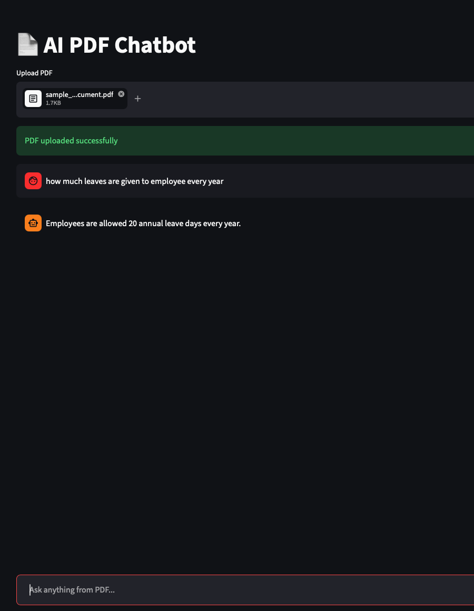

# 📄 AI PDF Chatbot

An intelligent AI-powered PDF chatbot built using:

* FastAPI
* Streamlit
* ChromaDB
* Gemini API
* Sentence Transformers
* RAG (Retrieval-Augmented Generation)

This application allows users to:

✅ Upload PDF documents
✅ Ask questions from PDFs
✅ Perform semantic search using embeddings
✅ Get AI-generated answers from document context
✅ Stream responses like ChatGPT

---

# 🚀 Features

* Real-time AI streaming responses
* Semantic vector search
* Persistent ChromaDB storage
* FastAPI backend
* Streamlit frontend
* Gemini LLM integration
* RAG architecture
* PDF chunking and embedding generation
* Production-ready deployment structure

---

# 🏗️ Project Architecture

```text
ai_pdf_chatbot/
│
├── backend/
│   ├── main.py
│   ├── rag.py
│   ├── database.py
│   ├── requirements.txt
│   ├── .env
│   ├── uploads/
│   └── chroma_db/
│
├── frontend/
│   ├── app.py
│   └── requirements.txt
│
└── README.md
```

---

# ⚙️ Technologies Used

## Backend

* FastAPI
* Uvicorn
* ChromaDB
* Sentence Transformers
* Gemini API
* LangChain Text Splitters
* PyPDF

## Frontend

* Streamlit
* Requests

---

# 🧠 How It Works

## Step 1 — Upload PDF

The user uploads a PDF through the Streamlit frontend.

---

## Step 2 — Text Extraction

The backend extracts text from the PDF using `PyPDF`.

---

## Step 3 — Chunking

Large text is split into smaller chunks using:

```python
RecursiveCharacterTextSplitter
```

---

## Step 4 — Embeddings

Each chunk is converted into embeddings using:

```python
SentenceTransformer("all-MiniLM-L6-v2")
```

---

## Step 5 — Store in ChromaDB

Embeddings and chunks are stored inside ChromaDB.

---

## Step 6 — Ask Questions

User asks a question.

The question is converted into embeddings.

---

## Step 7 — Semantic Search

ChromaDB retrieves the most relevant chunks.

---

## Step 8 — Gemini Response

Gemini generates answers ONLY from retrieved context.

---

## Step 9 — Streaming Response

The answer streams token-by-token to frontend.

---

# 🔧 Backend Setup

## 1. Navigate to backend

```bash
cd backend
```

---

## 2. Install dependencies

```bash
pip install -r requirements.txt
```

---

## 3. Create `.env`

```env
GEMINI_API_KEY=your_api_key_here
```

---

## 4. Run FastAPI server

```bash
uvicorn main:app --reload
```

Backend runs on:

```text
http://127.0.0.1:8000
```

---

# 🎨 Frontend Setup

## 1. Navigate to frontend

```bash
cd frontend
```

---

## 2. Install dependencies

```bash
pip install -r requirements.txt
```

---

## 3. Run Streamlit app

```bash
streamlit run app.py
```

Frontend runs on:

```text
http://localhost:8501
```

---

# 📦 Backend Requirements

```txt
fastapi
uvicorn
python-multipart
pypdf
langchain
langchain-text-splitters
sentence-transformers
chromadb
google-generativeai
python-dotenv
```

---

# 📦 Frontend Requirements

```txt
streamlit
requests
```

---

# 🌐 API Endpoints

## Home Route

```http
GET /
```

---

## Upload PDF

```http
POST /upload-pdf
```

Uploads and processes PDF.

---

## Ask Question

```http
POST /ask
```

Streams AI-generated response.

---

# ☁️ Deployment

## Backend Deployment — Render

### Start Command

```bash
uvicorn main:app --host 0.0.0.0 --port 10000
```

### Environment Variables

```env
GEMINI_API_KEY=your_key
CHROMA_DB_PATH=/opt/render/project/src/backend/chroma_db
```

---

## Frontend Deployment — Streamlit Cloud

Replace:

```python
BACKEND_URL = "http://127.0.0.1:8000"
```

with:

```python
BACKEND_URL = "https://your-backend.onrender.com"
```

---

# 📚 Future Improvements

* Multi-PDF support
* Authentication
* Chat memory
* Hybrid search
* Reranking
* Redis caching
* Docker support
* WebSocket streaming
* Citation highlighting
* Async background processing
* S3 cloud storage

---

# 🧪 Example Questions

* What is the leave policy?
* What are office timings?
* Summarize the document
* What technologies are used?
* Explain the company policy

---

# 🛡️ Notes

* Never upload `.env` to GitHub
* Add `.env` inside `.gitignore`
* Use persistent storage for ChromaDB in production

---

# 👨‍💻 Author

Built with ❤️ using FastAPI, Streamlit, Gemini, and ChromaDB.
<!-- The real time example are given below a dumy pdf file is uploaded -->
